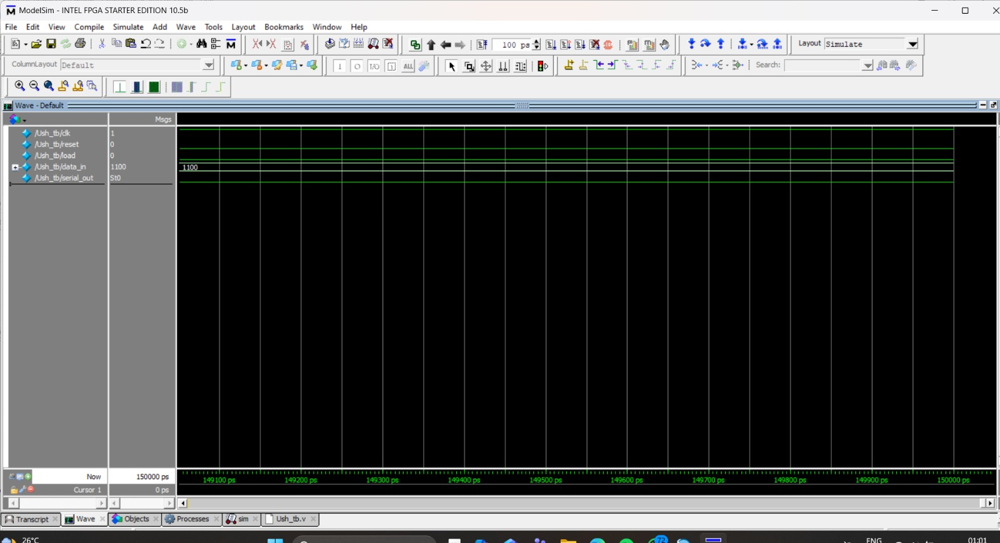

# 🔄 Universal Shift Register (4-bit) – Verilog

## 📌 Overview
This project implements a **4-bit Universal Shift Register** using Verilog HDL.  
A universal shift register can perform multiple operations such as:

- Parallel Load  
- Shift Left  
- Shift Right  
- Hold (No operation)  

The design is simulated using **ModelSim** and synthesized in **Intel Quartus Prime**.

---

## ⚙️ Features
- 4-bit data input and output  
- Supports multiple operations  
- Synchronous design using clock  
- Reset functionality included  
- RTL schematic generation  
- Functional simulation waveform  

---

## 🧩 Module Description

### Inputs:
- `clk` → Clock signal  
- `reset` → Reset signal  
- `load` → Enables parallel loading  
- `shift_left` → Shift data to left  
- `shift_right` → Shift data to right  
- `data_in[3:0]` → 4-bit parallel input  
- `serial_in` → Serial input  

### Output:
- `data_out[3:0]` → 4-bit output  

---

## 🔁 Working Principle
On every rising edge of the clock:

- If `reset = 1` → Output is cleared  
- If `load = 1` → Parallel data is loaded  
- If `shift_left = 1` → Data shifts left  
- If `shift_right = 1` → Data shifts right  
- Otherwise → Holds previous value  

---

## 🧪 Simulation Result
- The waveform shows binary transitions from `0000` to `1111`  
- Proper clock-driven operation is verified  
- Confirms correct shift and load functionality  

---

## 🧱 RTL Schematic
- Multiplexer-based input selection  
- Flip-flops used for storage  
- Control logic for shifting and loading  

---

## 🛠️ Tools Used
- ModelSim (Intel FPGA Starter Edition 10.5b)  
- Intel Quartus Prime Lite  
- Verilog HDL  

---

## 📂 Files Included
- `Ush.v` → Main module  
- `Ush_tb.v` → Testbench  
- Waveform output  
- RTL schematic  


## 🚀 How to Run

1. Open ModelSim  
2. Compile the files:
   ```bash
   vlog Ush.v Ush_tb.v


