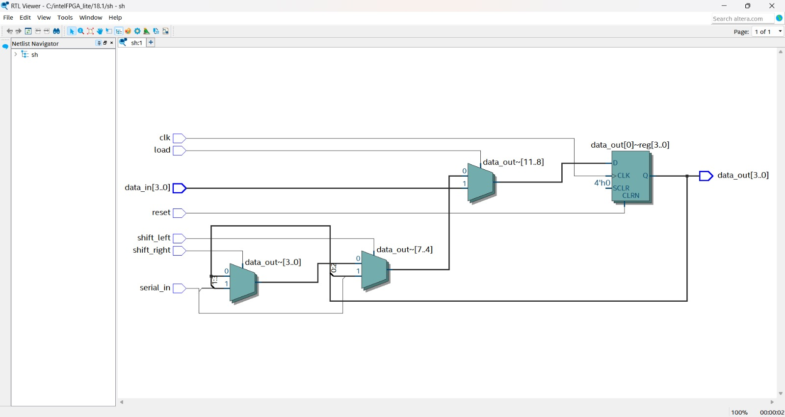
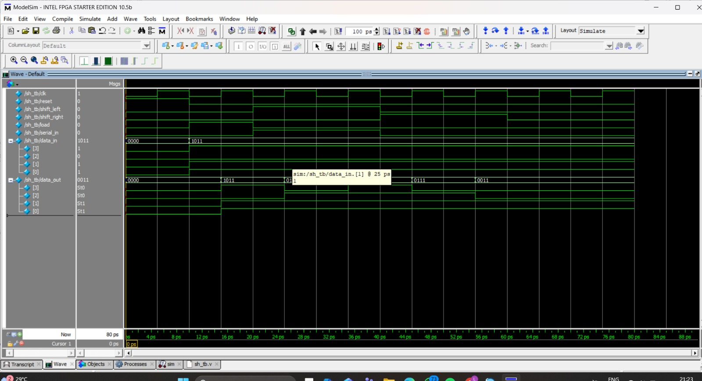

# 4_bit_Universal_Shift_Register

## 👨‍🎓 Student Details

**Name:** Manu R
**Branch:** Electronics and Communication Engineering (ECE)

---

## 📘 Project Description

This project implements a **4-bit Universal Shift Register** using Verilog HDL.
A universal shift register is capable of performing multiple operations such as **parallel load, shift left, shift right, and hold**.
The design is verified using ModelSim simulation and RTL (Register Transfer Level) visualization.

---

## ⚙️ Features

* Parallel data loading
* Shift left operation
* Shift right operation
* Serial input support
* Asynchronous reset
* Hold condition
* 4-bit output

---

## 🧩 Universal Shift Register Operations

| Control Signal | Operation                     |
| -------------- | ----------------------------- |
| reset = 1      | Clear register (0000)         |
| load = 1       | Load parallel data            |
| shift_left     | Shift left with serial input  |
| shift_right    | Shift right with serial input |
| none active    | Hold previous value           |

---

## 🧪 Simulation

The testbench verifies:

* Reset operation
* Parallel loading (example: 1011)
* Shift left and shift right operations
* Output changes on each clock cycle

---

## 📊 Simulation Waveform

<p align="center">
  
</p>

---

## 🔗 RTL / Netlist View

<p align="center">
  
</p>

---

## 🛠 Tools Used

* Verilog HDL
* ModelSim (Intel FPGA Starter Edition)

---

## ▶️ How to Run

1. Compile files:

   * sh.v
   * sh_tb.v

2. Simulate:

   ```
   vsim sh_tb
   ```

3. Run:

   ```
   add wave *
   run -all
   ```

---

## 📁 Project Structure

```id="0tz9xc"
4_bit_Shift_Register/
 ├── sh.v
 ├── sh_tb.v
 ├--netlist.png
 │--waveform1.png
 └── README.md
```

---

## 📌 Conclusion

The project successfully demonstrates a **4-bit Universal Shift Register** capable of performing multiple operations including load, shift left, shift right, and hold.
Simulation waveform and RTL view confirm the correct working of the design.



