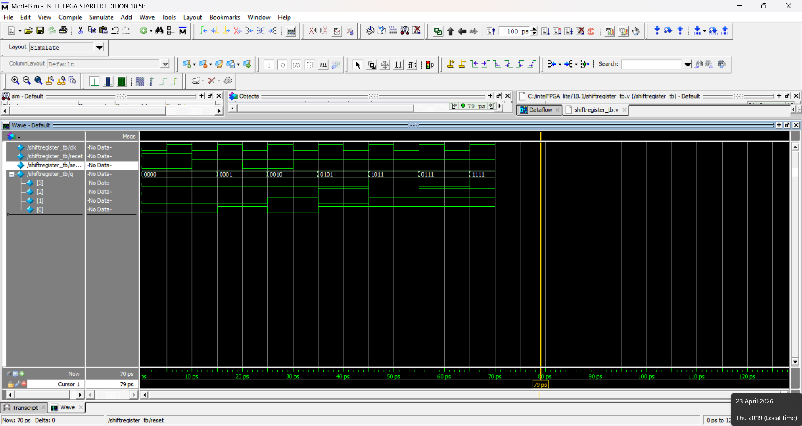
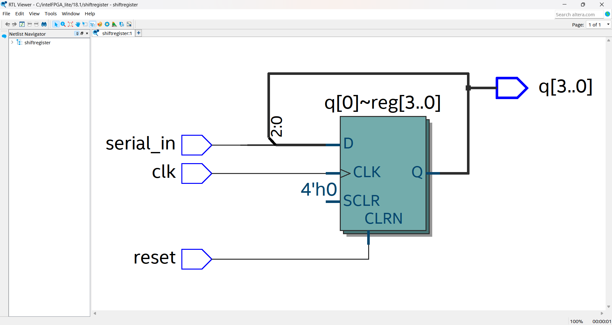

# 4_bit_Shift_Register

## 👨‍🎓 Student Details

**Name:** Manu R
**Branch:** Electronics and Communication Engineering (ECE)

---

## 📘 Project Description

This project implements a **4-bit shift register** using Verilog HDL. The design shifts serial input data into a 4-bit register on each clock pulse. An asynchronous reset is used to initialize the register.

---

## ⚙️ Features

* Serial input (serial_in)
* 4-bit parallel output (q[3:0])
* Asynchronous reset
* Positive edge clock triggering
* Verified using ModelSim simulation

---

## 🧩 Design Details

The shift operation is defined as:

q <= {q[2:0], serial_in}

* On reset → q = 0000
* On each clock → bits shift left and new input enters LSB

---

## 🧪 Testbench

The testbench:

* Generates clock signal
* Applies reset
* Sends input sequence: **1 → 0 → 1 → 1**
* Displays output using `$monitor`

---

## 📊 Expected Output

| Clock Cycle | Output (q[3:0]) |
| ----------- | --------------- |
| Reset       | 0000            |
| 1           | 0001            |
| 2           | 0010            |
| 3           | 0101            |
| 4           | 1011            |
| 5           | 0111            |
| 6           | 1111            |

---

## 🛠 Tools Used

* Verilog HDL
* ModelSim (Intel FPGA Starter Edition)

---

## ▶️ How to Run

1. Compile:
   sh.v
   sh_tb.v

2. Simulate:
   vsim sh_tb

3. Run waveform:
   add wave *
   run -all

---

## 📌 Conclusion

The project successfully demonstrates the working of a 4-bit shift register with correct shifting and reset behavior, validated through simulation.

---

## 📁 Files Included

* sh.v → Main design
* sh_tb.v → Testbench
* README.md → Documentation

